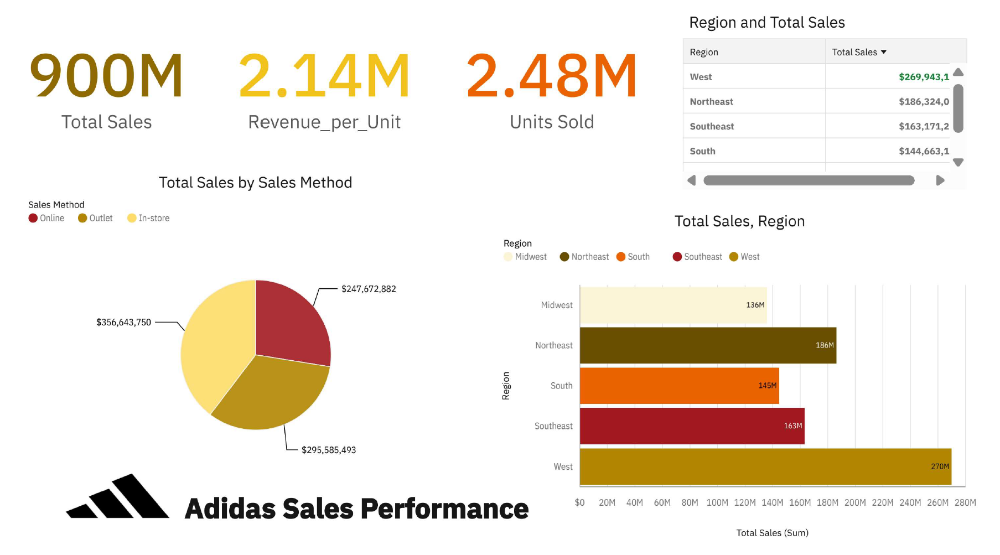

# Adidas Sales Data Dashboard

This project analyzes Adidas sales performance using IBM Cognos Analytics.

## What the dashboard shows:
- Total sales and revenue by region and country
- Revenue trends over time
- Top-performing products
- Sales breakdown by retailer

## Tools Used:
- IBM Cognos Analytics  
- Microsoft Excel (for data preparation)

## Dataset:
The dataset used in this dashboard is available in this repository: [adidas_sales.xlsx](./adidas_sales.xlsx)

## Dashboard Preview:

## Notes:
This project highlights interactive visualizations and key performance indicators (KPIs) to analyze Adidas sales.

## Future Improvements:
- Adding comparison with competitor brands
- Including customer segmentation analysis
- Building predictive insights for future sales
